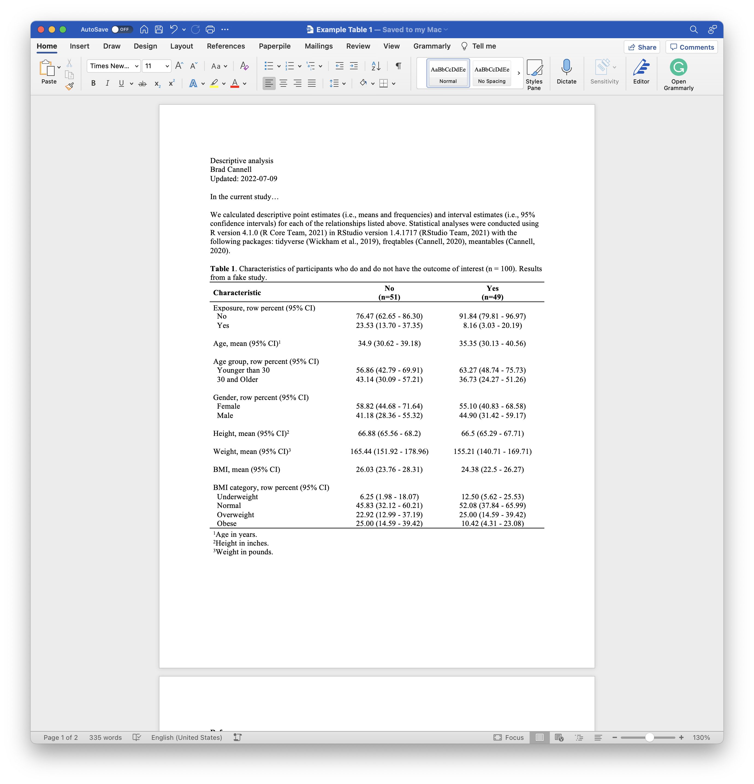

<!-- README.md is generated from README.Rmd. Please edit that file -->

```{r, include = FALSE}
knitr::opts_chunk$set(
  collapse = TRUE,
  comment = "#>",
  fig.path = "man/figures/README-",
  out.width = "100%"
)
```

# tabler

<!-- badges: start -->
<!-- badges: end -->

The immediate results of statistical analyses generated by R are rarely in a form that is ideal for the intended audience's use and consumption. The `tabler` package contains functions (and accompanying strategies) we can use to make our tabular results ready for presentation and/or dissemination.

Tables are one of the most popular ways to present information to our audience. When our goal is to show our readers precise numerical summaries of our data, the exact values that resulted from our analysis are important.

However, the specific details that we may want to present from table to table, or the way in which we want to present them, can vary widely. For example, an initial table of descriptive information about our participants may or may not be stratified by subgroups of interest. Additionally, our tables may include variables of different types (i.e., numerical or categorical), and for any given type, they may include various different kinds of numerical summaries. Further, there are numerous types of inferential models that result in numerical summaries that we may want to present in a table. For these reasons, it is difficult to create a good one-size-fits-all approach to automating the process of making results ready for presentation and dissemination.

Having said that, we walk through some basic strategies for automating the processes of putting results into presentation-ready summary tables below with the help of the `tabler` package. And we attempt to do so in a way that makes updating them (which happens A LOT) as painless as possible.

## Installation

You can install the development version of `tabler` like so:

```{r eval=FALSE}
# install.packages("devtools")
devtools::install_github("brad-cannell/tabler")
```

## Load data

For the purposes of making a self-contained examples, the `tabler` package comes with a small example data frame that is intended to have some of the features of real study data. We will use it to demonstrate how to use `tabler` below.

```{r}
# Load the tabler package
library(tabler)
```

```{r}
# Load example data
data(study)
```

```{r}
# View a sample of the study data
dplyr::glimpse(study)
```

## tabler functions

* **tabler:** The `tabler()` function assists with the creation of summary tables. The `tabler()` function always returns a data frame (or an error). 

## Example 1: Manually create table 1

This first example is perhaps the most common type of table we will create – a table 1 – or basic descriptive table about our participants. The screenshot below, which you can click to view/download on Dropbox, shows an example of what we ultimately want our table 1 to look like. You may also download it from the files pane above.

[](https://www.dropbox.com/s/8xftsn8yf1rsy7x/Example%20Table%201.docx?dl=0)

We will start by walking through the steps one might take to create this Table 1 in the absence of the `tabler` package. Later, we will show how the `tabler` package can make this process easier and more efficient. 

Let's go ahead and load [dplyr](https://dplyr.tidyverse.org/), [freqtables](https://github.com/brad-cannell/freqtables), and [meantables](https://github.com/brad-cannell/meantables) now.

```{r example}
library(dplyr, warn.conflicts = FALSE)
library(freqtables)
library(meantables)
```

### Create and fill-in the table 1 manually

A typical approach many people take to creating their tables is to manually create them in Microsoft Word, calculate the statistics needed to fill them in using R, and then manually typing the calculated statistics into the table. 

So, to reproduce the example above we will assume that we already created a shell in Microsoft Word. Next, we will calculate the number of people who experience the outcome of interest so that we can add subgroup sample sizes (i.e., "(n = )") to our column headers.

```{r}
n_outcome <- study %>% 
  count(outcome) %>% 
  pull(n) %>%
  rlang::set_names(levels(study$outcome))

n_outcome
```

A common next step would be to calculate our summary statistics for each variable of interest and then manually transcribe them into our table.

```{r}
study %>% 
  freq_table(outcome, exposure)
```

```{r}
study %>% 
  group_by(outcome) %>% 
  mean_table(age)
```

```{r}
study %>% 
  freq_table(outcome, age_group)
```

```{r}
study %>% 
  freq_table(outcome, sex)
```

```{r}
study %>% 
  group_by(outcome) %>% 
  mean_table(ht_in)
```

```{r}
study %>% 
  group_by(outcome) %>% 
  mean_table(wt_lbs)
```

```{r}
study %>% 
  group_by(outcome) %>% 
  mean_table(bmi)
```

```{r}
study %>% 
  freq_table(outcome, bmi_4cat)
```

Unfortunately, there are several potential issues with this method.

1. Lots of typing.

2. Error prone in copy and paste code. Error prone in transposing to word. 

3. Tedious. 

4. One change is a lot of work.

## Example 2: Use tabler to create table 1

We will start by demonstrating a complete, bare minimum example without any modification to our example data or any of the default values in the `tabler()` function. After walking through this example, we will demonstrate several ways to modify the results. We will also demonstrate the effects of adjusting some of `tabler()`s default values. Finally, we will demonstrate some techniques to make the table creation process more efficient in a couple of common use cases.

* Notice that the variables are passed to row_vars in the order we want them to appear.

```{r eval=FALSE}
study %>% 
  group_by(outcome) %>% 
  tabler(
    .row_vars = c(
      "Exposure, row percent (95% CI)"     = exposure, 
      "Age, mean (95% CI)"                 = age, 
      "Age group, row percent (95% CI)"    = age_group, 
      "Sex, row percent (95% CI)"          = sex, 
      "Height, mean (95% CI)"              = ht_in, 
      "Weight, mean (95% CI)"              = wt_lbs, 
      "BMI, mean (95% CI)"                 = bmi, 
      "BMI category, row percent (95% CI)" = bmi_4cat
    ),
    .fns_list = list(
      cont_stats_fn = c(age, ht_in, wt_lbs, bmi), 
      cat_stats_fn  = c(exposure, age_group, bmi_4cat)
    ),
    keep_na = FALSE
  )
```


