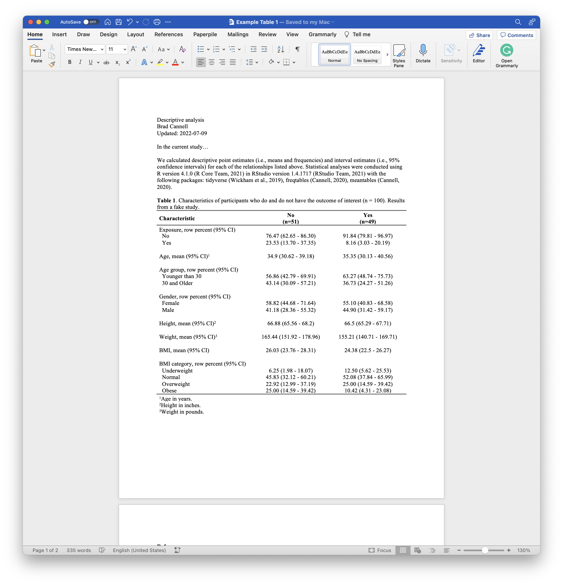

<!-- README.md is generated from README.Rmd. Please edit that file -->

# tabler 

<!-- badges: start -->
<!-- [](https://cran.r-project.org/package=tabler) -->
<!-- [](https://www.r-pkg.org/pkg/tabler) -->
<!-- badges: end -->

The immediate results of statistical analyses generated by R are rarely
in a form that is ideal for the intended audience’s use and consumption.
The `tabler` package contains functions (and accompanying strategies) we
can use to make our tabular results ready for presentation and/or
dissemination.

Tables are one of the most popular ways to present information to our
audience. When our goal is to show our readers precise numerical
summaries of our data, the exact values that resulted from our analysis
are important.

However, the specific details that we may want to present from table to
table, or the way in which we want to present them, can vary widely. For
example, an initial table of descriptive information about our
participants may or may not be stratified by subgroups of interest.
Additionally, our tables may include variables of different types (i.e.,
numerical or categorical), and for any given type, they may include
various different kinds of numerical summaries. Further, there are
numerous types of inferential models that result in numerical summaries
that we may want to present in a table. For these reasons, it is
difficult to create a good one-size-fits-all approach to automating the
process of making results ready for presentation and dissemination.

Having said that, we walk through some basic strategies for automating
the processes of putting results into presentation-ready summary tables
below with the help of the `tabler` package. And we attempt to do so in
a way that makes updating them (which happens A LOT) as painless as
possible.

## Installation

You can install the development version of `tabler` like so:

``` r
# install.packages("devtools")
devtools::install_github("brad-cannell/tabler")
```

## Load data

For the purposes of making a self-contained examples, the `tabler`
package comes with a small example data frame that is intended to have
some of the features of real study data. We will use it to demonstrate
how to use `tabler` below.

``` r
# Load the tabler package
library(tabler)
```

<!-- For testing: devtools::load_all() -->

``` r
# Load example data
data(study)
```

``` r
# View a sample of the study data
dplyr::glimpse(study)
#> Rows: 100
#> Columns: 10
#> $ id        <int> 1, 2, NA, 4, 5, 6, 7, 8, 9, 10, 11, 12, 13, 14, 15, 16, 17, …
#> $ age       <dbl> 32, 30, 32, 29, 24, 38, 25, 24, 48, 29, 22, 29, 24, 28, 24, …
#> $ age_group <fct> 30 and Older, 30 and Older, 30 and Older, Younger than 30, Y…
#> $ sex       <fct> Male, Female, Female, NA, Female, Female, Female, Male, Male…
#> $ ht_in     <dbl> 70, 63, 62, 67, NA, 58, 64, 69, 65, 68, 63, 68, 69, 66, 67, …
#> $ wt_lbs    <dbl> 216, 106, 145, 195, 143, 125, 138, 140, 158, 167, 145, 297, …
#> $ bmi       <dbl> 30.99, 18.78, 26.52, 30.54, NA, 26.12, 23.69, 20.67, 26.29, …
#> $ bmi_4cat  <fct> Obese, Normal, Overweight, Obese, NA, Overweight, Normal, No…
#> $ exposure  <fct> No, No, No, No, Yes, Yes, No, No, No, No, Yes, No, No, No, N…
#> $ outcome   <fct> No, Yes, No, No, No, Yes, Yes, Yes, Yes, Yes, No, Yes, No, Y…
```

## tabler functions

-   **tabler:** The `tabler()` function assists with the creation of
    summary tables. The `tabler()` function always returns a data frame
    (or an error).

## Example 1: Manually create table 1

This first example is perhaps the most common type of table we will
create – a table 1 – or basic descriptive table about our participants.
The screenshot below, which you can click to view/download on Dropbox,
shows an example of what we ultimately want our table 1 to look like.
You may also download it from the files pane above.

[](https://www.dropbox.com/s/8xftsn8yf1rsy7x/Example%20Table%201.docx?dl=0)

We will start by walking through the steps one might take to create this
Table 1 in the absence of the `tabler` package. Later, we will show how
the `tabler` package can make this process easier and more efficient.

Let’s go ahead and load [dplyr](https://dplyr.tidyverse.org/),
[freqtables](https://github.com/brad-cannell/freqtables), and
[meantables](https://github.com/brad-cannell/meantables) now.

``` r
library(dplyr, warn.conflicts = FALSE)
library(freqtables)
library(meantables)
```

### Create and fill-in the table 1 manually

A typical approach many people take to creating their tables is to
manually create them in Microsoft Word, calculate the statistics needed
to fill them in using R, and then manually typing the calculated
statistics into the table.

So, to reproduce the example above we will assume that we already
created a shell in Microsoft Word. Next, we will calculate the number of
people who experience the outcome of interest so that we can add
subgroup sample sizes (i.e., “(n = )”) to our column headers.

``` r
n_outcome <- study %>% 
  count(outcome) %>% 
  pull(n) %>%
  rlang::set_names(levels(study$outcome))

n_outcome
#>  No Yes 
#>  51  49
```

A common next step would be to calculate our summary statistics for each
variable of interest and then manually transcribe them into our table.

``` r
study %>% 
  freq_table(outcome, exposure)
#> # A tibble: 4 × 17
#>   row_var row_cat col_var  col_cat     n n_row n_total percent…¹ se_to…² t_cri…³
#>   <chr>   <chr>   <chr>    <chr>   <int> <int>   <int>     <dbl>   <dbl>   <dbl>
#> 1 outcome No      exposure No         38    51     100        38    4.88    1.98
#> 2 outcome No      exposure Yes        13    51     100        13    3.38    1.98
#> 3 outcome Yes     exposure No         47    49     100        47    5.02    1.98
#> 4 outcome Yes     exposure Yes         2    49     100         2    1.41    1.98
#> # … with 7 more variables: lcl_total <dbl>, ucl_total <dbl>, percent_row <dbl>,
#> #   se_row <dbl>, t_crit_row <dbl>, lcl_row <dbl>, ucl_row <dbl>, and
#> #   abbreviated variable names ¹​percent_total, ²​se_total, ³​t_crit_total
#> # ℹ Use `colnames()` to see all variable names
```

``` r
study %>% 
  group_by(outcome) %>% 
  mean_table(age)
#> # A tibble: 2 × 11
#>   response_var group_var group…¹     n  mean    sd   sem   lcl   ucl   min   max
#>   <chr>        <chr>     <fct>   <int> <dbl> <dbl> <dbl> <dbl> <dbl> <dbl> <dbl>
#> 1 age          outcome   No         51  35.5  16.5  2.31  30.9  40.2    22    84
#> 2 age          outcome   Yes        49  34.7  16.9  2.42  29.8  39.6    18    84
#> # … with abbreviated variable name ¹​group_cat
```

``` r
study %>% 
  freq_table(outcome, age_group)
#> # A tibble: 4 × 17
#>   row_var row_cat col_var   col_cat      n n_row n_total perce…¹ se_to…² t_cri…³
#>   <chr>   <chr>   <chr>     <chr>    <int> <int>   <int>   <dbl>   <dbl>   <dbl>
#> 1 outcome No      age_group Younger…    30    51     100      30    4.61    1.98
#> 2 outcome No      age_group 30 and …    21    51     100      21    4.09    1.98
#> 3 outcome Yes     age_group Younger…    30    49     100      30    4.61    1.98
#> 4 outcome Yes     age_group 30 and …    19    49     100      19    3.94    1.98
#> # … with 7 more variables: lcl_total <dbl>, ucl_total <dbl>, percent_row <dbl>,
#> #   se_row <dbl>, t_crit_row <dbl>, lcl_row <dbl>, ucl_row <dbl>, and
#> #   abbreviated variable names ¹​percent_total, ²​se_total, ³​t_crit_total
#> # ℹ Use `colnames()` to see all variable names
```

``` r
study %>% 
  freq_table(outcome, sex)
#> # A tibble: 5 × 17
#>   row_var row_cat col_var col_cat     n n_row n_total percent_…¹ se_to…² t_cri…³
#>   <chr>   <chr>   <chr>   <chr>   <int> <int>   <int>      <dbl>   <dbl>   <dbl>
#> 1 outcome No      sex     Female     26    51     100         26    4.41    1.98
#> 2 outcome No      sex     Male       24    51     100         24    4.29    1.98
#> 3 outcome No      sex     <NA>        1    51     100          1    1       1.98
#> 4 outcome Yes     sex     Female     31    49     100         31    4.65    1.98
#> 5 outcome Yes     sex     Male       18    49     100         18    3.86    1.98
#> # … with 7 more variables: lcl_total <dbl>, ucl_total <dbl>, percent_row <dbl>,
#> #   se_row <dbl>, t_crit_row <dbl>, lcl_row <dbl>, ucl_row <dbl>, and
#> #   abbreviated variable names ¹​percent_total, ²​se_total, ³​t_crit_total
#> # ℹ Use `colnames()` to see all variable names
```

``` r
study %>% 
  group_by(outcome) %>% 
  mean_table(ht_in)
#> # A tibble: 2 × 11
#>   response_var group_var group…¹     n  mean    sd   sem   lcl   ucl   min   max
#>   <chr>        <chr>     <fct>   <int> <dbl> <dbl> <dbl> <dbl> <dbl> <dbl> <dbl>
#> 1 ht_in        outcome   No         50  66.6  4.39 0.620  65.3  67.8    58    76
#> 2 ht_in        outcome   Yes        46  66.8  4.46 0.657  65.5  68.2    58    76
#> # … with abbreviated variable name ¹​group_cat
```

``` r
study %>% 
  group_by(outcome) %>% 
  mean_table(wt_lbs)
#> # A tibble: 2 × 11
#>   response_var group_var group…¹     n  mean    sd   sem   lcl   ucl   min   max
#>   <chr>        <chr>     <fct>   <int> <dbl> <dbl> <dbl> <dbl> <dbl> <dbl> <dbl>
#> 1 wt_lbs       outcome   No         50  164.  48.7  6.89  150.  178.    92   269
#> 2 wt_lbs       outcome   Yes        48  157.  49.0  7.08  142.  171.    60   297
#> # … with abbreviated variable name ¹​group_cat
```

``` r
study %>% 
  group_by(outcome) %>% 
  mean_table(bmi)
#> # A tibble: 2 × 11
#>   response_var group_var group…¹     n  mean    sd   sem   lcl   ucl   min   max
#>   <chr>        <chr>     <fct>   <int> <dbl> <dbl> <dbl> <dbl> <dbl> <dbl> <dbl>
#> 1 bmi          outcome   No         49  26.0  7.21  1.03  24.0  28.1  14.6  45.2
#> 2 bmi          outcome   Yes        46  24.4  7.25  1.07  22.2  26.5  10.6  49.3
#> # … with abbreviated variable name ¹​group_cat
```

``` r
study %>% 
  freq_table(outcome, bmi_4cat)
#> # A tibble: 10 × 17
#>    row_var row_cat col_var  col_cat      n n_row n_total perce…¹ se_to…² t_cri…³
#>    <chr>   <chr>   <chr>    <chr>    <int> <int>   <int>   <dbl>   <dbl>   <dbl>
#>  1 outcome No      bmi_4cat Underwe…     3    51     100       3    1.71    1.98
#>  2 outcome No      bmi_4cat Normal      21    51     100      21    4.09    1.98
#>  3 outcome No      bmi_4cat Overwei…    12    51     100      12    3.27    1.98
#>  4 outcome No      bmi_4cat Obese       13    51     100      13    3.38    1.98
#>  5 outcome No      bmi_4cat <NA>         2    51     100       2    1.41    1.98
#>  6 outcome Yes     bmi_4cat Underwe…     6    49     100       6    2.39    1.98
#>  7 outcome Yes     bmi_4cat Normal      25    49     100      25    4.35    1.98
#>  8 outcome Yes     bmi_4cat Overwei…    11    49     100      11    3.14    1.98
#>  9 outcome Yes     bmi_4cat Obese        4    49     100       4    1.97    1.98
#> 10 outcome Yes     bmi_4cat <NA>         3    49     100       3    1.71    1.98
#> # … with 7 more variables: lcl_total <dbl>, ucl_total <dbl>, percent_row <dbl>,
#> #   se_row <dbl>, t_crit_row <dbl>, lcl_row <dbl>, ucl_row <dbl>, and
#> #   abbreviated variable names ¹​percent_total, ²​se_total, ³​t_crit_total
#> # ℹ Use `colnames()` to see all variable names
```

Unfortunately, there are several potential issues with this method.

1.  Lots of typing.

2.  Error prone in copy and paste code. Error prone in transposing to
    word.

3.  Tedious.

4.  One change is a lot of work.

## Example 2: Use tabler to create table 1

We will start by demonstrating a complete, bare minimum example without
any modification to our example data or any of the default values in the
`tabler()` function. After walking through this example, we will
demonstrate several ways to modify the results. We will also demonstrate
the effects of adjusting some of `tabler()`s default values. Finally, we
will demonstrate some techniques to make the table creation process more
efficient in a couple of common use cases.

-   Notice that the variables are passed to row_vars in the order we
    want them to appear.

``` r
study %>% 
  group_by(outcome) %>% 
  tabler(
    .row_vars = c(
      "Exposure, row percent (95% CI)"     = exposure, 
      "Age, mean (95% CI)"                 = age, 
      "Age group, row percent (95% CI)"    = age_group, 
      "Sex, row percent (95% CI)"          = sex, 
      "Height, mean (95% CI)"              = ht_in, 
      "Weight, mean (95% CI)"              = wt_lbs, 
      "BMI, mean (95% CI)"                 = bmi, 
      "BMI category, row percent (95% CI)" = bmi_4cat
    ),
    .fns_list = list(
      cont_stats_fn = c(age, ht_in, wt_lbs, bmi), 
      cat_stats_fn  = c(exposure, age_group, bmi_4cat)
    ),
    keep_na = FALSE
  )
```
